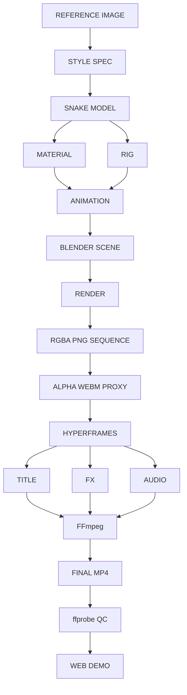

# 十二生肖 · 蛇宝宝

以参考图为视觉基准的 5.8 秒动画。Blender 生成角色和透明 RGBA PNG，HyperFrames 编排字幕、图形、音轨，FFmpeg 编码并由 ffprobe 验收。

## 快速开始

需要 Node.js 22+、Blender 5.2、FFmpeg（含 libvpx-vp9、libx264、AAC）与 ffprobe。浏览器由 HyperFrames 管理。已锁定 HyperFrames 0.8.62、GSAP 3.14.2；npm ci 重现 Node 依赖。

```bash
cd "/Users/xiwei/video making"
npm ci
npm run doctor
npm run blender:render
npm run render:final
npm run qc
npm run web
```

打开 http://localhost:5173。加 ?debug=1 查看编码和构建信息。网页有播放控件和 Replay 按钮，不依赖自动播放。

## 命令

| 命令 | 产物 / 用途 |
|---|---|
| npm run doctor | 版本、配置、参考图、字体、目录写入、Blender 最小无界面渲染 |
| npm test | 检查 QC 是否能拒绝错误规格 |
| npm run blender:build | 从空白环境建立并保存 Blender 场景 |
| npm run blender:render -- --views | 模型正面、3/4、侧面 |
| npm run blender:render -- --preview | 720p PNG 序列 |
| npm run blender:render | 1080p PNG 序列，场景缺失时自动构建 |
| npm run render | 720p 完整合成和编码 |
| npm run render:final | 1080p 合成、音轨、最终编码、QC、poster |
| npm run preview | HyperFrames Studio，localhost:5174 |
| npm run qc | ffprobe 验收最终 MP4，outputs/qc.json |
| npm run web | localhost:5173 成片播放器 |

## 统一规格与交换格式

config/project.json 管理输出尺寸、fps、时长、采样率及路径。默认 1920×1080、30fps、5.8 秒（174 帧）、AAC 48kHz。预览为 1280×720。

Blender 标准输出为 generated/blender/snake_demo/frame_000001.png 至 frame_000174.png，RGBA。透明 WebM 是浏览器播放代理，PNG 是权威交换素材。代理使用 VP9 yuva420p；最终交付 H.264 yuv420p + AAC。PNG 的 alpha 在转换及 HyperFrames 解码时必须保留。

源代码在 src/snake-demo：layers.mjs 拆分 Background、ZodiacGraphic、BlenderSnake、FX、Title、Audio；timeline.js 是暂停、可任意定位的 GSAP 时间线。scripts/compose.mjs 把统一配置装配为 generated/composition/index.html。请修改源代码后重新生成，避免直接编辑 generated 下的文件。

## 故事节奏

0–1s 暖色舞台与生肖图形；1–4.2s 蛇宝宝探头、轻弹、眨眼、轻摆、吐舌；4.2–5.8s 标题、星光与最终姿态，保留结束停留。

## 制作 DAG



## 资源与许可

- 参考图：用户提供，assets/reference/zodiac_base_reference.png。
- 音效：scripts/audio.mjs 自制钟琴短音，48kHz 立体声，可重新生成，无外部配乐。
- 中文字体：Noto Serif SC 子集，Google Fonts，SIL OFL 1.1，assets/fonts/OFL.txt。
- HyperFrames：Apache 2.0；GSAP：遵循其发行包许可。
- 项目级 HyperFrames Skills 在 .agents/skills。官方在线安装器网络失败后，从官方 GitHub 源码归档安装；未修改全局技能。

## 重建与范围

不使用 Blender VSE、不生成其他 11 个 3D 动物、不调用 AI 视频生成或付费服务。Blender 场景、PNG 序列、缓存和最终视频属于可再生产物，默认不提交 Git；源代码、参考图、配置、字体与技能提交 Git。没有创建远程仓库；本地 Git 项目可按需推送。

9:16 仅保留配置扩展空间，当前版式专为 16:9 验收，竖版需要重新排版，不能只改尺寸。
