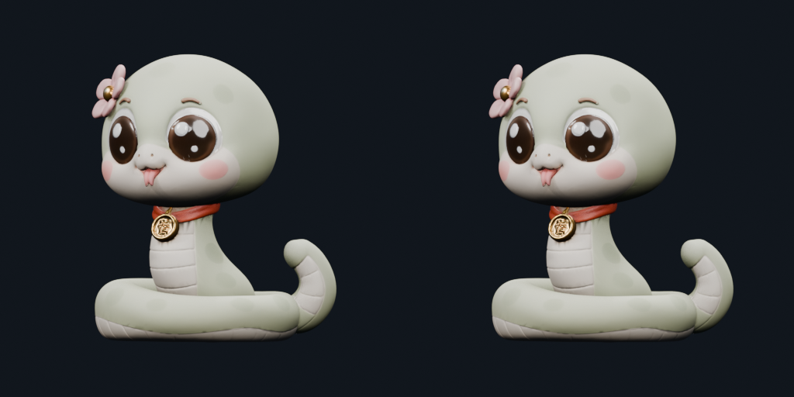
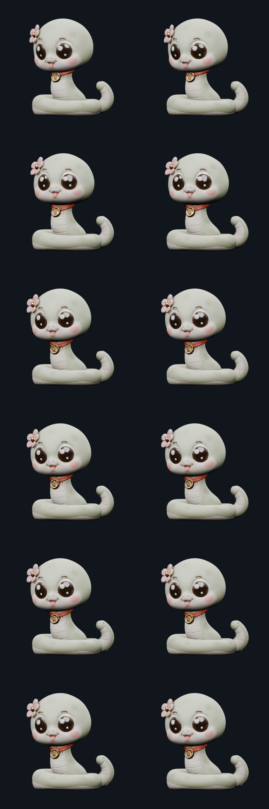

# G5.5 — Component Consolidation / Runtime Asset Gate

**Gate result:** `RUNTIME ASSET GATE = PASS / HUMAN REVIEW`

## Policy

The runtime asset is a derived copy of Character V1. Consolidation groups only loose islands that already share one Puppet parent bone. It does not change the character's appearance, action amplitudes, UVs, material nodes, PBR images, or smooth-skinning strategy.

Blink remains the documented fallback. TailWag remains a normal webpage viewing-distance review item.

## Before / after

| Metric | Before | After |
|---|---:|---:|
| Component mesh objects | 460 | **9** |
| Vertices | 30,479 | 30,479 |
| Polygons | 49,916 | 49,916 |
| Triangles | 49,916 | 49,916 |
| Materials | 1 (`Material.001`) | 1 (`Material.001`) |
| PBR images | 3 | 3 |
| Controller bones | 10 | 10 |
| Authored GLB size | 30,164,728 bytes | **29,736,608 bytes** |

The GLB size change is **-428,120 bytes**. The larger runtime gain is the mesh-object reduction of **451 objects**, which removes the main draw-call risk without changing geometry density.

Machine metrics: [`runtime_consolidation_metrics.json`](../runtime_consolidation_metrics.json)

Controller grouping detail: [`runtime_consolidation_mapping.json`](../runtime_consolidation_mapping.json)

## Consolidation map

```text
BODY_NECK   42 islands → RUNTIME_BODY_NECK
COIL_BASE   42 islands → RUNTIME_COIL_BASE
EYE_L       12 islands → RUNTIME_EYE_L
EYE_R       15 islands → RUNTIME_EYE_R
HEAD       257 islands → RUNTIME_HEAD
MEDALLION   55 islands → RUNTIME_MEDALLION
TAIL_ROOT   11 islands → RUNTIME_TAIL_ROOT
TAIL_TIP     7 islands → RUNTIME_TAIL_TIP
TONGUE      19 islands → RUNTIME_TONGUE
```

The two tail meshes remain separate because they intentionally follow `TAIL_ROOT` and `TAIL_TIP`. The two eye meshes remain separate because they intentionally follow `EYE_L` and `EYE_R`.

## Regression checks

The following checks are all PASS in [`runtime_gate.json`](../runtime_gate.json):

- semantic mesh consolidation;
- Material.001 and three PBR image preservation;
- neutral plus six action world-space vertex hashes;
- controller/skeleton and action frame survival;
- fresh Blender GLB import with nine component meshes and nine bone-parented components.





## Independent asset inspection

`runtime_glb_metrics.json` reports Blender asset-validation hard gate PASS: 9 mesh objects, 49,916 triangles, 3 images, 1 material, 10 bones, 7 actions, 0 degenerate faces, 0 invalid vertices, and full UV coverage. Boundary/non-manifold edges are the expected result of keeping the nine runtime modules as separate rigid components.

## Stop condition

This phase stops here. Three.js runtime testing is the next gate and has not been started.
